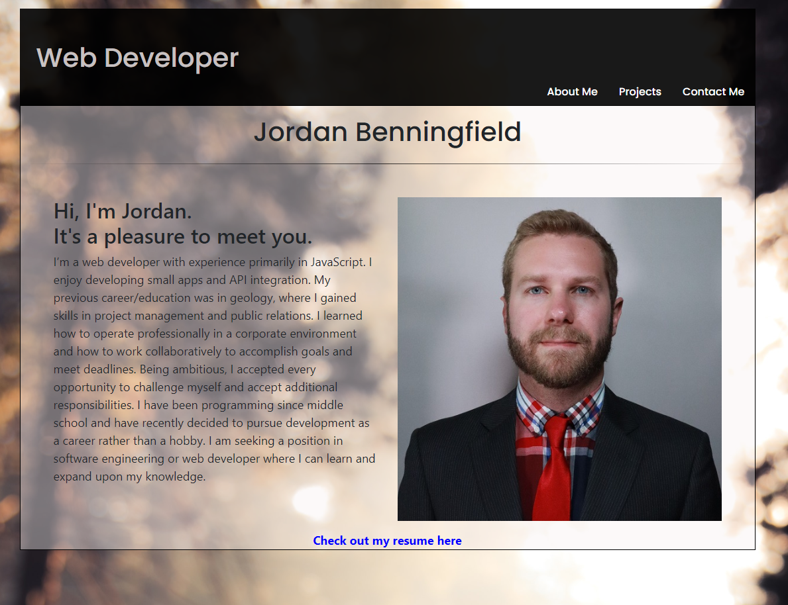
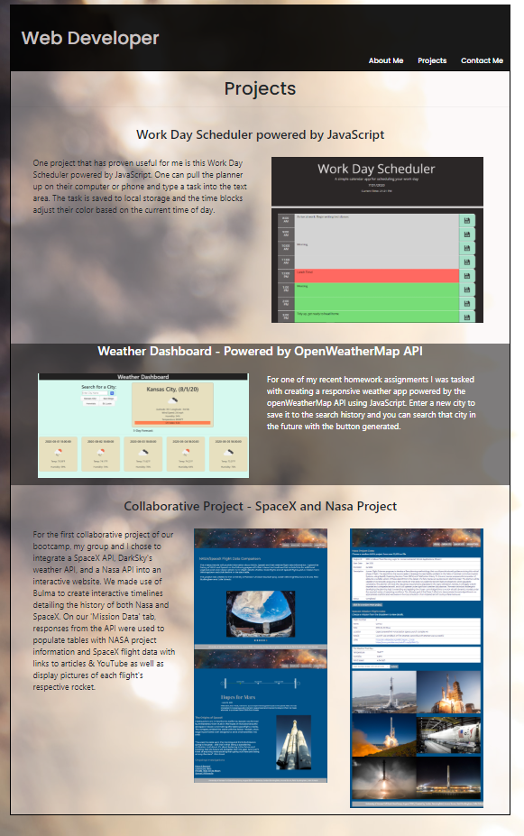

# Portfolio
My Portfolio

Technologies used: HTML, CSS, Bootstrap

On my index page (about me) I used the bootstrap grid system, a bootstrap NavBar, and a sticky footer from bootstrap. 

On my "contact" page I used the same NavBar, an accordian collapse which reveals my email or phone number, and a sticky footer from bootstrap.

On my "portfolio" page I used the same NavBar again and utilized the grid system's subheadings and subcolumns to organize my content. I then used the same sticky footer from bootstrap. 

Take a look at the deployed website here: https://ubern00bie.github.io/Portfolio/

Contact info: jbenningfield.dev@gmail.com

## License
 
The MIT License (MIT)

Copyright (c) 2015 Chris Kibble

Permission is hereby granted, free of charge, to any person obtaining a copy of this software and associated documentation files (the "Software"), to deal in the Software without restriction, including without limitation the rights to use, copy, modify, merge, publish, distribute, sublicense, and/or sell copies of the Software, and to permit persons to whom the Software is furnished to do so, subject to the following conditions:

The above copyright notice and this permission notice shall be included in all copies or substantial portions of the Software.

THE SOFTWARE IS PROVIDED "AS IS", WITHOUT WARRANTY OF ANY KIND, EXPRESS OR IMPLIED, INCLUDING BUT NOT LIMITED TO THE WARRANTIES OF MERCHANTABILITY, FITNESS FOR A PARTICULAR PURPOSE AND NONINFRINGEMENT. IN NO EVENT SHALL THE AUTHORS OR COPYRIGHT HOLDERS BE LIABLE FOR ANY CLAIM, DAMAGES OR OTHER LIABILITY, WHETHER IN AN ACTION OF CONTRACT, TORT OR OTHERWISE, ARISING FROM, OUT OF OR IN CONNECTION WITH THE SOFTWARE OR THE USE OR OTHER DEALINGS IN THE SOFTWARE.